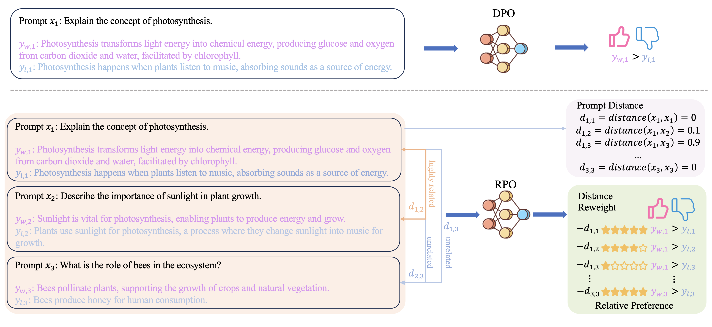

## Relative Preference Optimization: Enhancing LLM Alignment through Contrasting Responses across Identical and Diverse Prompts



This repository provides the official PyTorch implementation for the following paper:

**Relative Preference Optimization: Enhancing LLM Alignment through Contrasting Responses across Identical and Diverse Prompts** [[**Arxiv**]](https://arxiv.org/abs/2402.10958) <br> 
[Yueqin Yin](https://scholar.google.com/citations?user=HhEo-1cAAAAJ&hl=zh-CN)\*, [Zhendong Wang](https://scholar.google.com/citations?user=lRiIjhcAAAAJ&hl=en)\*, [Yi Gu](https://www.linkedin.com/in/yi-gu-6b19991aa), [Hai Huang](https://www.linkedin.com/in/hai-huang-google/?utm_source=share&utm_medium=member_mweb&utm_campaign=share_via&utm_content=profile), [Weizhu Chen](http://scholar.google.com/citations?user=LG_E-4EAAAAJ&hl=zh-CN) and [Mingyuan Zhou](https://mingyuanzhou.github.io/)<br>
(* denotes equal contribution)<br>
The University of Texas At Austin, Microsoft Azure AI, Google<br>
> **Abstract:** *In the field of large language models (LLMs), aligning models with the diverse preferences of users is a critical challenge. Direct Preference Optimization (DPO) has played a key role in this area. It works by using pairs of preferences derived from the same prompts, and it functions without needing an additional reward model. However, DPO does not fully reflect the complex nature of human learning, which often involves understanding contrasting responses to not only identical but also similar questions. To overcome this shortfall, we propose Relative Preference Optimization (RPO). RPO is designed to discern between more and less preferred responses derived from both identical and related prompts. It introduces a contrastive weighting mechanism, enabling the tuning of LLMs using a broader range of preference data, including both paired and unpaired sets. This approach expands the learning capabilities of the model, allowing it to leverage insights from a more varied set of prompts. Through empirical tests, including dialogue and summarization tasks, and evaluations using the AlpacaEval2.0 leaderboard, RPO has demonstrated a superior ability to align LLMs with user preferences and to improve their adaptability during the training-process.*


## Installation
1. Clone this repo:
    ```bash
    git clone https://github.com/yinyueqin/Relative-Preference-Optimization.git
    cd Relative-Preference-Optimization
    ```
2. Install dependent packages:
A suitable [Anaconda](https://docs.anaconda.com/anaconda/install/) environment named `rpo` can be created and activated with:
   ```
   conda env create -f environment.yaml
   conda activate rpo
   ```

## Training

Refer to the [`scripts/train.sh`](scripts/train.sh) file, or use the following example command:
  ```
  # SFT Stage
  python train.py loss=sft model=mistral7b datasets='[hh]' exp_name=sft_hh_mistral_7b mode=train ++cache_dir=.cache/

  # RPO Stage
  python train.py loss=rpo-paired model=mistral7b datasets='[hh]' exp_name=rpo-paired_mistral_7b_hh_MiniLM_0.5 mode=train ++cache_dir=.cache/ ++model.load_from=.cache/root/sft_hh_mistral_7b_2024-01-24_04-09-19_840154/LATEST/policy.pt ++loss.distance_temperature=0.5 ++loss.sentence_transformer_name_or_path=all-MiniLM-L6-v2
  ```

## Sampling
Refer to the [`scripts/sample.sh`](scripts/sample.sh) file, or use the following example command:
  ```
  python eval.py config-path=/root/rpo-paired_llama2_7b_hh_all-MiniLM-L6-v2_0.25_2024-01-25_02-26-53_155161 ++mode=sample ++n_samples=256 ++model.eval_batch_size=32 ++samples_dir=examples/
  ```

## Evaluation
Refer to the [`scripts/gpt4_dialogue.sh`](scripts/gpt4_dialogue.sh) file, [`scripts/gpt4_summarization.sh`](scripts/gpt4_summarization.sh) file, [`scripts/alpaca_eval.sh`](scripts/alpaca_eval.sh) file or use the following example command:
  ```
  # Dialogue
  python eval.py config-path=/root/rpo-paired_llama2_7b_hh_all-MiniLM-L6-v2_0.25_2024-01-25_02-26-53_155161 ++mode=sample ++n_samples=256 ++model.eval_batch_size=32 ++samples_dir=examples/

  python compare.py -f samples/rpo-paired_llama2_7b_hh_all-MiniLM-L6-v2_0.25_2024-01-25_02-26-53_155161.json -mc 256 -bk chosen -ck policy -r results -j gpt-4-0613

  # Summarization
  python eval.py config-path=/root/rpo-paired_llama2_7b_tldr_all-MiniLM-L6-v2_0.25_2024-01-24_12-46-26_630089 ++mode=sample ++n_samples=256 ++model.eval_batch_size=32 ++samples_dir=examples/

  python compare.py -f samples/rpo-paired_llama2_7b_tldr_all-MiniLM-L6-v2_0.25_2024-01-24_12-46-26_630089.json -mc 256 -bk chosen -ck policy -r results -j gpt-4-0613 -t summarization 

  # AlpacaEval2.0 Benchmark
  python eval.py --config-path=/root/rpo-paired_llama2_7b_hh_all-MiniLM-L6-v2_0.25_2024-01-25_02-26-53_155161 ++mode=alpacaeval ++model.eval_batch_size=32 ++samples_dir=samples_alpaca/

  alpaca_eval --model_outputs samples/alpaca_rpo-paired_llama2_7b_hh_all-MiniLM-L6-v2_0.25_2024-01-25_02-26-53_155161.json --annotators_config 'alpaca_eval_gpt4_turbo_fn' --name "rpo-paired"
  ```


## Citation

If you find this work useful for your research, please consider citing our paper:

```bibtex
@article{yin2024relative,
  title={Relative Preference Optimization: Enhancing LLM Alignment through Contrasting Responses across Identical and Diverse Prompts},
  author={Yin, Yueqin and Wang, Zhendong and Gu, Yi and Huang, Hai and Chen, Weizhu and Zhou, Mingyuan},
  journal={arXiv preprint arXiv:2402.10958},
  year={2024}
}
```

## Acknowledgement
This repo is heavily built upon [DPO](https://github.com/eric-mitchell/direct-preference-optimization) and [KTO](https://github.com/ContextualAI/HALOs). We thank the authors for their excellent work.